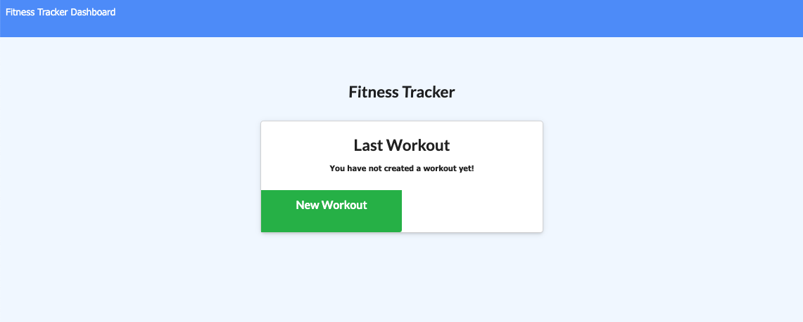
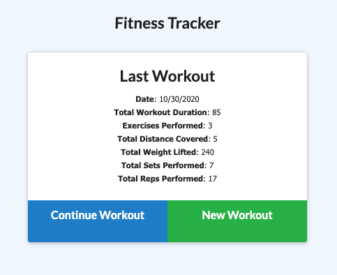

# Fitness Tracker

## Description

An application that creates and tracks daily workouts. Users can log multiple exercises in a workout on a given day. Users can track the name, type, weight, sets, reps, and duration of exercise. If the exercise is a cardio exercise, users can track distance traveled.

## Languages

## Features

When the user loads the page, they are given the option to create a new workout or continue with their last workout.

The user can:

- Add new exercises to a new workout plan.
  

- Add exercises to a previous workout plan.
  

- View the combined weight of multiple exercises on the `stats` page.
  

## Deployment & Repository

- Heroku: https://fitness-tracker-5678.herokuapp.com/
- GitHub: https://github.com/bridgetrshannon/Fitness_Tracker
